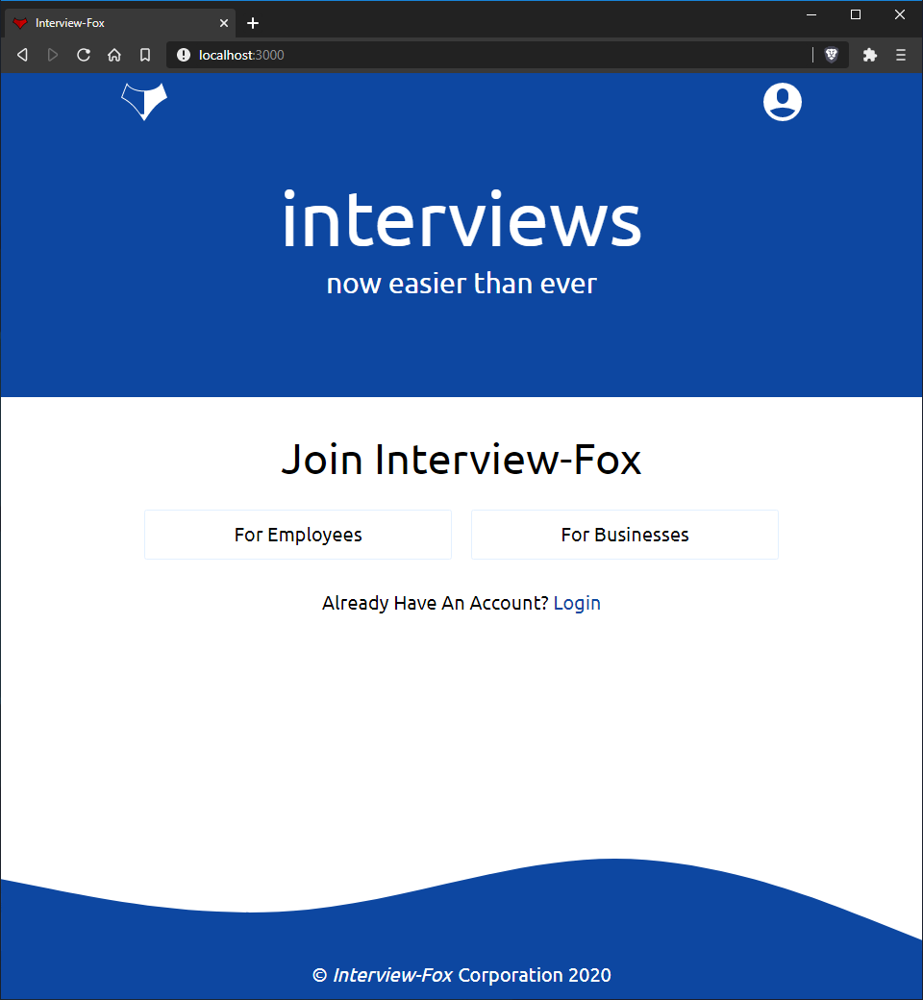
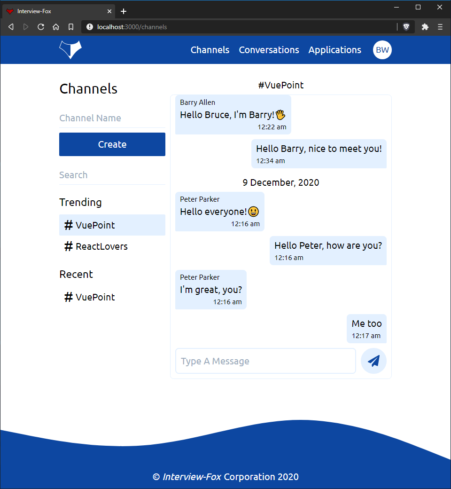
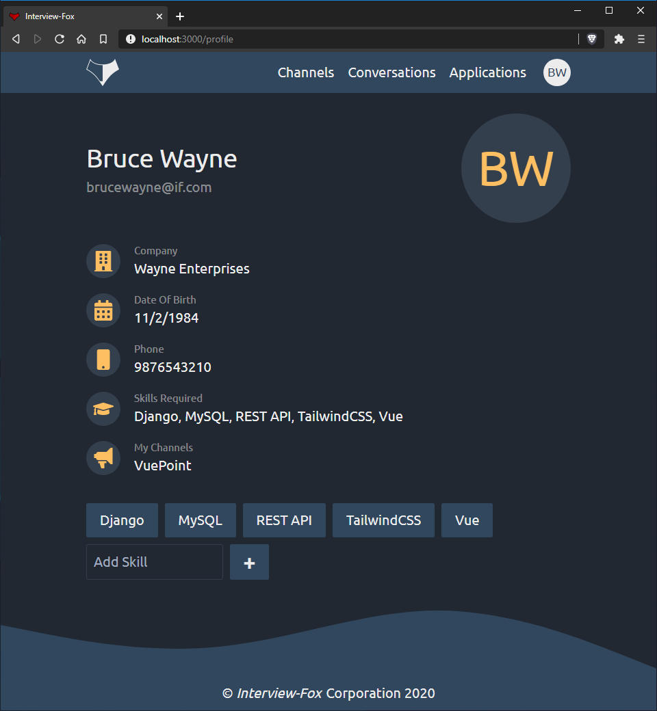
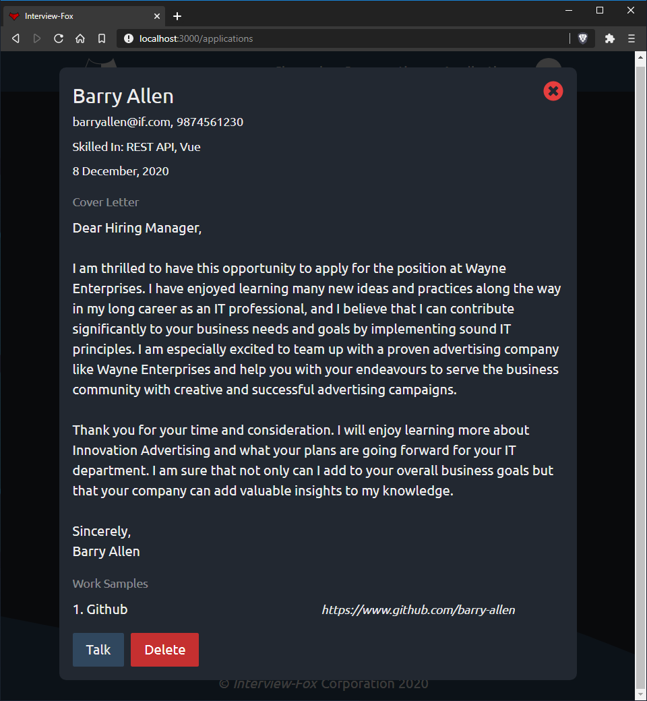
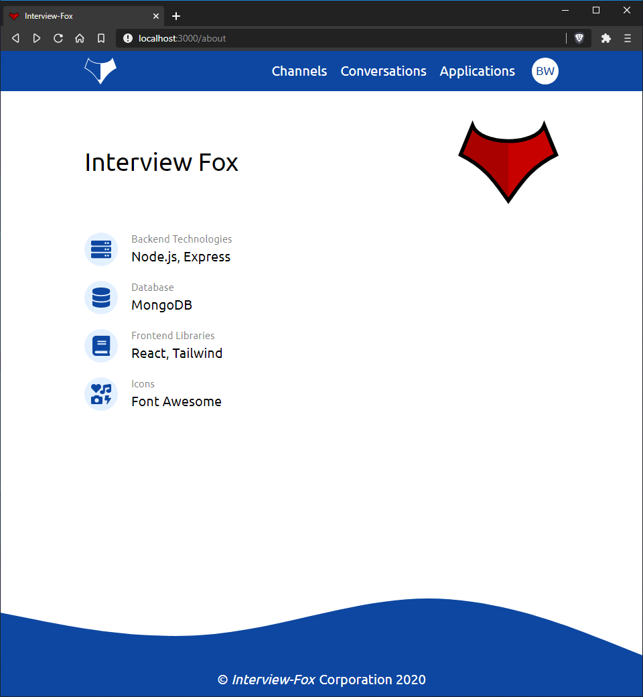

# interview_fox
An interviewing and social platform for businesses and employees.

On the backend this project uses Node.js, Express and MongoDB for serving the API whereas the frontend uses React and TailwindCSS

    
